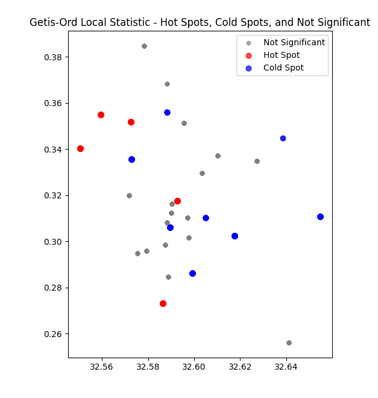
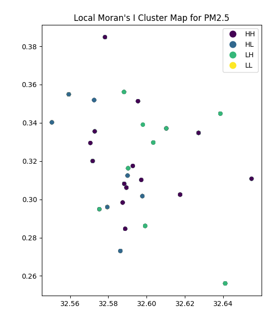
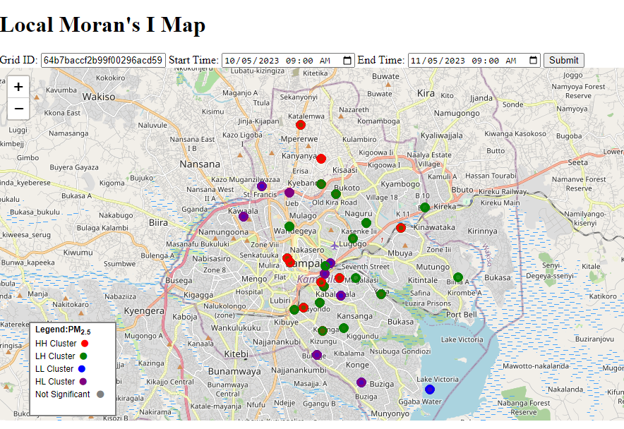

# My_research-lab
uses a mono repo 

[Getis-Ord-Local-Statistic](https://github.com/wabinyai/My_research-lab/tree/main/src/Getis-Ord-Local-Statistic)

Getis-Ord Gi* statistic, is used to measure spatial autocorrelation and identify hot-spots (clusters of high attribute levels) and cold-spots (clusters of low attribute levels) with varying of significance.
Getis-Ord Gi* statistic, is used to measure spatial autocorrelation and identify hot-spots (clusters of high attribute levels) and cold-spots (clusters of low attribute levels) with varying.

:

|Visual you run["python main.py"] |Visual you run["python app.py" or "flask run"] |
|----------|----------|
|  | COMING SOON |

[local_moran](https://github.com/wabinyai/My_research-lab/tree/main/src/local_moran_with_API)

Local Moran’s I is a local spatial autocorrelation statistic proposed by Anselin as a way to
identify local clusters and outliers. In python this function is realized by the Cluster and Outlier
Analysis (Anselin Local Moran’s I) tool.  

|Visual you run["python main.py"] |Visual you run["python app.py" or "flask run"] |
|----------|----------|
|  |  |
 

 
 
